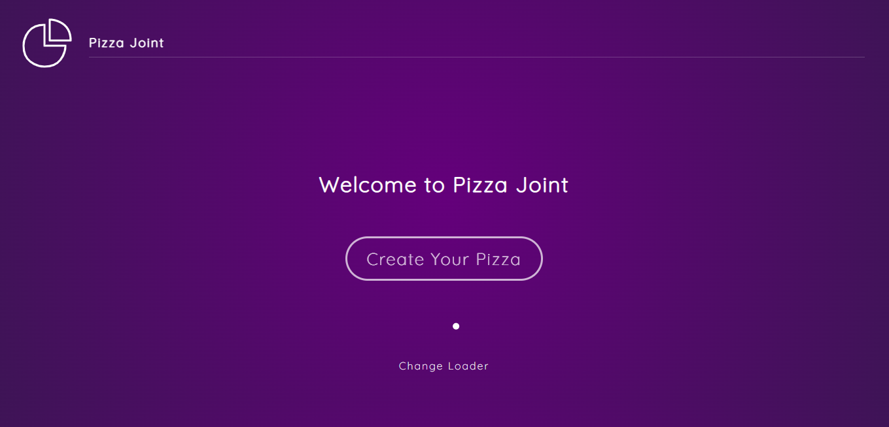

# Framer Motion

Framer Motion is a simple delivery website that allows customers to place orders and registers their purchases. This project was developed as a learning exercise to explore the capabilities of React with Framer Motion for adding animations to the website. The main technologies used in this project are React, HTML, CSS, and react-framer-motion.

## Description

SimpleDelivery provides a user-friendly interface for customers to browse and order their favorite products. Customers can easily navigate through different categories, view product details, and add items to their cart. The website incorporates smooth and visually appealing animations using the react-framer-motion library, enhancing the overall user experience.

One of the key features of SimpleDelivery is the seamless ordering process. Customers can quickly select items, specify quantities, and add them to the cart. The cart dynamically updates, displaying the total price and the list of selected items. Customers can review their order, make changes if needed, and proceed to checkout with a simple and intuitive process.

The website also offers a responsive design, ensuring that customers can access and use SimpleDelivery on various devices, including desktops, tablets, and mobile phones. The layout adjusts automatically to provide an optimized experience across different screen sizes.

## Installation

To run SimpleDelivery locally on your machine, follow these steps:

1. Clone the repository: `git clone https://github.com/jonasmachados/framer-motion.git`
2. Install the dependencies: `npm install`
3. Start the development server: `npm start`
4. Open your web browser and navigate to `http://localhost:3000`

## Usage

- Browse through the available categories and products
- Click on a product to view more details
- Add products to your cart by specifying the quantity
- Review your order in the cart, make any necessary changes
- Proceed to checkout and complete your order

## Contributing

Contributions are welcome! If you have any ideas, suggestions, or improvements, please open an issue or submit a pull request.

## License

This project is licensed under the [MIT License](LICENSE).

